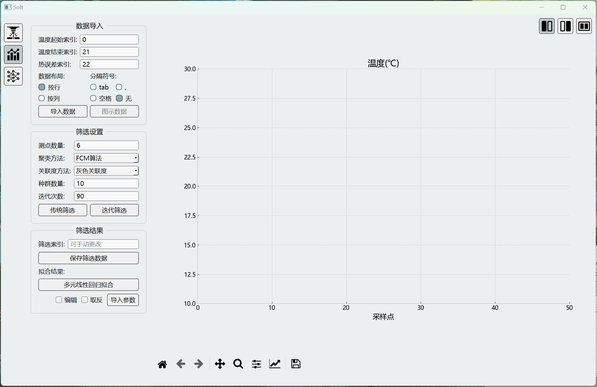
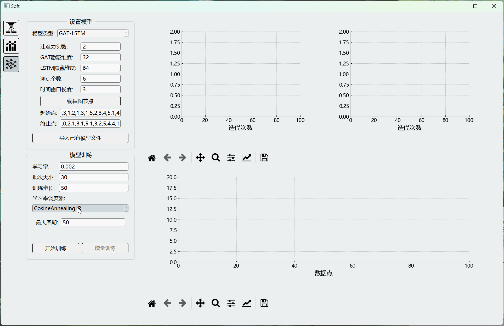
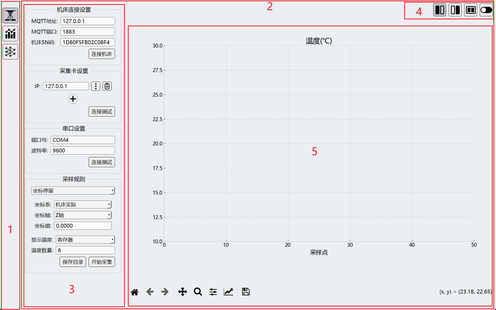

## 1. 配置运行环境

- 安装虚拟环境库
- 在当前目录创建虚拟环境，位置在`.env`文件夹
- 激活虚拟环境
- 安装依赖
- 运行程序

```bash
pip install virtualenv
python -m venv .env
.env\Scripts\activate
pip install -r requirements.txt
.\.env\Scripts\python.exe .\main.py   
```

目前存在的问题:

- 连接设备成功后，如果中途断联导致采集到None，或者空列表会出错，因为没有添加错误处理
- 向机床导入多元线性回归的拟合参数功能还没测试
- 很多输入框获取数时直接采用的是 `int(xxx.text())` ，只要少部分加了`QValidator`，如果转换错误会导致程序崩溃

使用视频:






## 2. 开发

### 2.1. UI组成



- 侧边导航栏`(1)`，切换页面到 采集数据\分析数据\训练模型\代理模型，也可以用 `CTRL + UP \ DOWN` 来翻页
- 右侧整个是一个`QStackedWidget`(堆叠控件)，堆叠了四个页面
- 每个页面中，左侧`(2)`是一些相关的设置`(4)`，中间是一个`QSplitter`(拖拉调整比例), 右侧为图像显示区域,包含显示内容切换按钮`(5)`、图像区域`(3)`和图像工具栏`(6)`
- 下方(7)是状态信息栏

命令行运行：

- `.\.env\Scripts\python.exe -m src.pages.sample`只显示采集数据页面UI
- `.\.env\Scripts\python.exe -m src.pages.tsp`只显示分析数据页面UI
- `.\.env\Scripts\python.exe -m src.pages.model`只显示训练模型页面UI
- `.\.env\Scripts\python.exe -m src.pages.compen`只显示代理模型页面UI

格式化所有python代码：

```powershell
black --line-length 100 ./src/
```

### 2.2. 设计模式

[MVC设计模式](https://www.runoob.com/design-pattern/mvc-pattern.html)

- `src/view.py`负责显示界面和产生交互信息, 所有界面产生的信号都汇聚在了`Class View`下

- `src/state.py`负责存储程序状态和逻辑处理，包括数据的采集、分析、模型训练，同样也汇聚了所有信号

- `src/controller.py`负责连接交互和逻辑，主要连接两边的`Qt信号`和`Qt槽函数`

### 2.3. 机床通讯

利用基于`MQTT`协议的`NC-Link`通讯

- 对于8型系统，它作为一个MQTT客户端，不具备MQTT代理，所以本地电脑需要安装MQTT代理，例如 [mosquitto](https://mosquitto.org/)，所以输入项中的"MQTT地址"需要填写本地地址；数控系统端还需要把NC-LINK设置下的地址改为电脑IP
- 对于9型系统，由于内置了mosquitto，所以地址填写9型系统上位机IP地址

**注意事项**: 连接之前需要关闭电脑的防火墙

### 2.4 添加热误差预测模型

#### 2.4.1 界面参数

在`src\components\model_choose.py`中：

- 界面添加模型所需参数的输入：
`create_model_type_widget`方法下添加相应的参数`widget`, 并添加到`model_stacked`
- 添加更新模型显示条件分支：
`update_model_type_widget`方法下添加对应模型名称的`match`分支, 并设置切换页面
- 设置传递的模型字典信号：
`get_model_para`方法下添加对应模型名称的`match`分支, 设置好传递的模型参数字典

#### 2.4.2 后端逻辑

`src\state.py`中：

- 设置导入模型：
`reset_model`方法下`match`分支添加模型实例化方法
- 创建训练数据集：
`get_datasets`方法下`match`分支添加模型训练数据集创建方法
- 设置`DataLoader`（因为`torch_geometric`和`torch`的`DataLoader`是不兼容的）：
`train_thread_start`方法下确定用到的`DataLoader`

`src\thread\model_train_thread.py`(非必要)

- 如果用到了除了`torch_geometric`和`torch`的`DataLoader`另外的`DataLoader`, 还需在`get_loss`方法中添加对应计算损失值的方法
