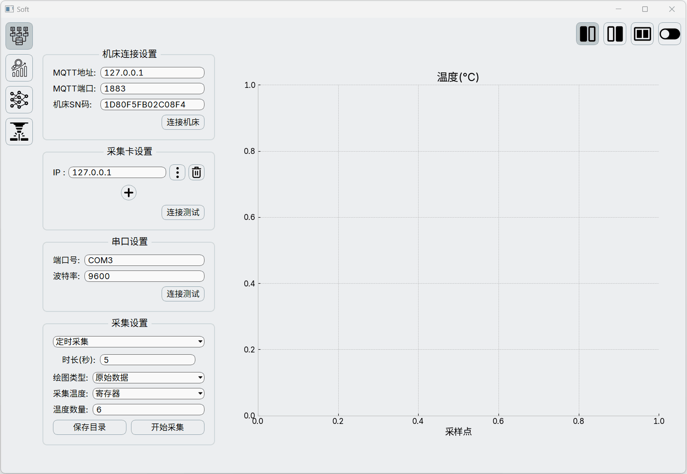
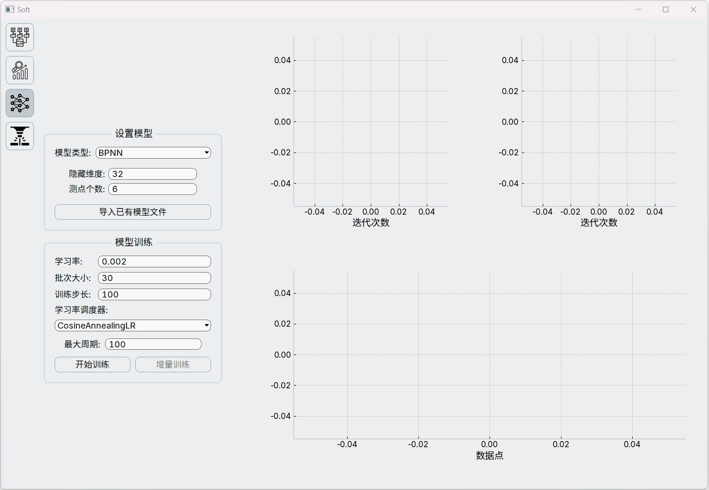

## 1. 配置环境

#### 1.1. 安装依赖

- 安装`更纱黑体`字体，[下载链接](https://mirrors.tuna.tsinghua.edu.cn/github-release/be5invis/Sarasa-Gothic/Sarasa%20Gothic%2C%20Version%201.0.21/SarasaUiSC-TTF-1.0.21.7z)

- 安装虚拟环境库
```bash
pip install virtualenv
```
- 在当前目录创建虚拟环境，位置在`.env`文件夹
```bash
python -m venv .env
```
- 激活虚拟环境
```bash
.env\Scripts\activate
```
- 在虚拟环境中安装依赖
```bash
pip install -r requirements.txt
```
- 运行程序
```bash
.env\Scripts\python.exe .\main.py   
```

如果安装完字体, `matplotlib`还是提示缺失字体，删除`C:\Users\xxx\.matplotlib`文件夹下的所有文件后重试（字体缓存）

#### 1.2. 待完成事项

- 很多输入框获取数时直接采用的是 `int(xxx.text())` ，只有少部分加了`QValidator`，如果转换错误会导致程序崩溃
- 直接根据现有温度预测补偿值进行补偿；

#### 1.3. 使用视频:






#### 1.4. 使用示例

概念解释：

- 原始数据：点击`开始采集`后，数据采集线程每一秒采集到的所有数据
- 规则数据：可以直接作为热误差模型训练数据的，经过筛选过的数据

##### 1.4.1. 连接多张采集卡进行温度测点筛选实验

- 连接机床（可选），当需要保存工况-温度数据 或 采样规则为`坐标停留`才必须要连接机床
- 配置每张采集卡参数，一般只需修改`IP`，当采集卡有空缺位时可以用 `排除序号` 来进行剔除，避免影响图示
- 连接量表，暂时只能连接一个串口，后续准备改成可以添加的形式
- 选择`采样规则`（后面详细解释）, `采集温度`选择采集卡
- 选择保存目录（可选），若没选择，则自动保存在`data`文件夹下名为`xxx_orin\rule.csv`（原始\规则）
- 点击`开始采集`即可开始采集数据

##### 1.4.2. 采样规则简介

`定时采集`：每隔设定的时间采集为规则数据

`坐标停留`：检测数控系统选择的坐标轴在选择坐标系下的值停留3秒不变则视为一次主动碰表，采集为规则数据

`量表停留`：检测量表读数在初始值正负设定的阈值内停留3秒视为一次主动碰表，采集为规则数据

##### 1.4.3. 采集过程中

- 状态栏会显示目前采集的原始数据、规则数据、错误数据的组数以及采集时长
- 右侧图像可以切换显示 `温度\热误差` 以及 `原始\规则数据`，也可`关闭\打开`图像更新，节省资源
- TODO: 计划添加一块表格视图用于显示具体数值

##### 1.4.4 通过机床G寄存器采集温度

- 参考 [1.4.1](#141-连接多张采集卡进行温度测点筛选实验)
- `采集温度`选择寄存器，下方可以设置采集的温度数量

##### 1.4.5 

## 2. 开发

### 2.1. UI组成


- 侧边导航栏`(1)`，切换页面到 采集数据\分析数据\训练模型\代理模型，也可以用 `CTRL + UP \ DOWN` 来翻页
- 右侧整个是一个`QStackedWidget`(堆叠控件)，堆叠了四个页面
- 每个页面中，左侧`(2)`是一些相关的设置`(4)`，中间是一个`QSplitter`(拖拉调整比例), 右侧为图像显示区域,包含显示内容切换按钮`(5)`、图像区域`(3)`和图像工具栏`(6)`
- 下方(7)是状态信息栏

命令行运行：

- `.\.env\Scripts\python.exe -m src.pages.sample`只显示采集数据页面UI
- `.\.env\Scripts\python.exe -m src.pages.tsp`只显示分析数据页面UI
- `.\.env\Scripts\python.exe -m src.pages.model`只显示训练模型页面UI
- `.\.env\Scripts\python.exe -m src.pages.compen`只显示代理模型页面UI

格式化所有python代码， 统一样式：

```powershell
black --line-length 100 ./src/
```

### 2.2. 设计模式

[MVC设计模式](https://www.runoob.com/design-pattern/mvc-pattern.html)

- `src/view.py`负责显示界面和产生交互信息, 所有界面产生的信号都汇聚在了`Class View`下

- `src/state.py`负责存储程序状态和逻辑处理，包括数据的采集、分析、模型训练、参数拟合，同样也汇聚了所有信号

- `src/controller.py`负责连接交互和逻辑，主要连接两边的`Qt信号`和`Qt槽函数`

### 2.3. 机床通讯

利用基于`MQTT`协议的`NC-Link`通讯

- 对于8型系统，它作为一个MQTT客户端，不具备MQTT代理，所以本地电脑需要安装MQTT代理，例如 [mosquitto](https://mosquitto.org/)，所以输入项中的"MQTT地址"需要填写本地地址；数控系统端还需要把NC-LINK设置下的地址改为电脑IP
- 对于9型系统，由于内置了mosquitto，所以地址填写9型系统上位机IP地址

**注意事项**: 连接之前需要关闭电脑的防火墙

### 2.4 添加热误差预测模型

#### 2.4.1 界面参数

在`src\components\model_choose.py`中：

- 添加模型名称:
  `__init__`下添加，例如`self.model_type.addItem("BPNN")`

- 界面添加模型所需参数的输入：
`create_model_type_widget`方法下添加相应的参数`widget`, 并添加到`model_stacked`
- 添加更新模型显示条件分支：
`update_model_type_widget`方法下添加对应模型名称的`match`分支, 并设置切换页面
- 设置传递的模型字典信号：
`get_model_para`方法下添加对应模型名称的`match`分支, 设置好传递的模型参数字典

#### 2.4.2 后端逻辑

**导入模型：**

在`src\state.py`下：

- 设置导入模型：
`reset_model`方法下`match`分支添加模型实例化方法

**训练相关：**

在`src\state.py`下：

- 创建训练数据集：
  `get_datasets`方法下`match`分支添加模型训练数据集创建方法
- 设置`DataLoader`（因为`torch_geometric`和`torch`的`DataLoader`是不兼容的）：
  `get_data_loader`方法下确定用到的`DataLoader`

在`src\thread\model_train_thread.py`下：

- 如果用到了除了`torch_geometric`和`torch`的`DataLoader`另外的`DataLoader`, 还需在`get_loss`方法中添加对应计算损失值的方法

**补偿相关：**

在`src\state.py`下：

- 根据预测温升（加上历史温升）计算热误差：
  `get_pred_err`方法下添加对应模型得到预测输出值的方法

### 2.5 调试软件

- 采集卡(Modbus TCP)用`Modbus Slave`进行调试，[Modbus Slave](https://filecr.com/windows/modbus-slave/)
- 量表用`com0com`(创建串口间的映射)和`PuTTY`(向串口输出值)进行调试，[com0com](https://sourceforge.net/projects/com0com/)，[PuTTY](https://www.chiark.greenend.org.uk/~sgtatham/putty/latest.html);